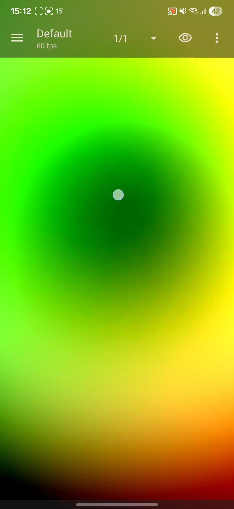
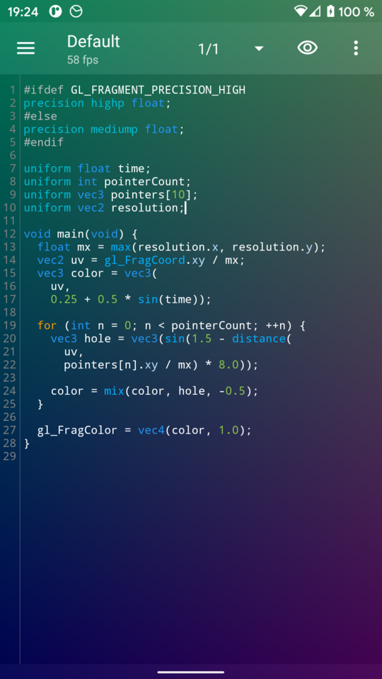

<p align="center">
  
</p>

# ShaderEditor

<p align="center">
  <strong>GLSL fragment shader editor and live wallpaper for Android.</strong><br>
  Write shaders, preview them live, feed them textures, sensors, camera, and audio, then wear them as wallpaper.
</p>

<p align="center">
  <a href="https://markusfisch.github.io/ShaderEditor/">Documentation &amp; examples</a>
  ·
  <a href="FAQ.md">FAQ</a>
  ·
  <a href="CHANGELOG.md">Changelog</a>
  ·
  <a href="CONTRIBUTING.md">Contributing</a>
</p>

<p align="center">
  <a href="https://markusfisch.github.io/ShaderEditor/">
    
  </a>
</p>

<p align="center">
  
</p>

ShaderEditor is a full GLSL playground for Android phones and tablets. It combines a code editor, real-time preview, shader library, texture pipeline, sensor/camera/audio uniforms, and live wallpaper support in a single app. The project is free, open source, and MIT-licensed.

| Item | Value |
| --- | --- |
| Platform | Android 6.0+ (API 23+) |
| Shader stage | Fragment shaders |
| Graphics | OpenGL ES 2.0 baseline, with automatic GLES 3.0 / 3.1 / 3.2 contexts when requested and supported |
| Source | Java 17, Gradle Kotlin DSL |
| License | [MIT](LICENSE) |

## Contents

- [Download](#download)
- [Highlights](#highlights)
- [Screenshot gallery](#screenshot-gallery)
- [Quick start](#quick-start)
- [Built-in uniform overview](#built-in-uniform-overview)
- [Permissions and privacy](#permissions-and-privacy)
- [Documentation and learning resources](#documentation-and-learning-resources)
- [Build from source](#build-from-source)
- [Repository layout](#repository-layout)
- [Contributing](#contributing)
- [Support](#support)
- [License](#license)

## Download

<p>
  <a href="https://f-droid.org/en/packages/de.markusfisch.android.shadereditor/">
    
  </a>
  <a href="https://play.google.com/store/apps/details?id=de.markusfisch.android.shadereditor">
    
  </a>
</p>

- Interactive docs site: <https://markusfisch.github.io/ShaderEditor/>
- Issue tracker: <https://github.com/markusfisch/ShaderEditor/issues>

## Highlights

| Area | What you get |
| --- | --- |
| **Live preview** | Instant preview behind editor, manual run modes, separate preview activity, FPS counter, and per-shader render-quality scaling |
| **Editor** | GLSL syntax highlighting, inline compile errors, undo/redo, smart completions above keyboard, bracket pairing, line numbers, coding fonts, and optional ligatures |
| **Inputs** | Built-in uniforms for time, resolution, touch, `pointers[10]`, wallpaper offset, battery, date/daytime, notification count, media volume, microphone amplitude, and more |
| **Sensors & camera** | Gravity, linear acceleration, gyroscope, magnetic field, light, pressure, proximity, rotation/orientation matrices, and front/back camera feeds as live textures |
| **Textures & feedback** | Imported 2D textures, cube maps, built-in noise textures, backbuffer feedback, sampler wrap/filter controls, and cropped image import flow |
| **Wallpaper** | Set any shader as live wallpaper, respond to home-screen offsets, and pause rendering on low battery when battery saver mode is enabled |
| **Learning tools** | 12 bundled sample shaders, ShaderToy `mainImage()` paste conversion, and walkthroughs on docs site |

> [!TIP]
> Put `#version 300 es`, `#version 310 es`, or `#version 320 es` on the **very first line** of your shader to request a GLES 3.x context automatically.

## Screenshot gallery

<details>
<summary><strong>Open gallery</strong></summary>

| Live editing | Smart completions | Error highlighting |
| --- | --- | --- |
|  |  |  |

| Shader library | Uniform picker | Live wallpaper |
| --- | --- | --- |
|  |  |  |

More screenshots, videos, and walkthroughs live on [markusfisch.github.io/ShaderEditor](https://markusfisch.github.io/ShaderEditor/).

</details>

## Quick start

Paste fragment shader below into a new shader to get immediate results:

```glsl
#ifdef GL_FRAGMENT_PRECISION_HIGH
precision highp float;
#else
precision mediump float;
#endif

uniform float time;
uniform vec2 resolution;

void main(void) {
	vec2 uv = gl_FragCoord.xy / resolution;
	vec3 col = 0.5 + 0.5 * cos(time + uv.xyx + vec3(0.0, 2.0, 4.0));
	gl_FragColor = vec4(col, 1.0);
}
```

This snippet uses two core uniforms:

- `resolution` — viewport size in pixels
- `time` — seconds since shader start

ShaderToy snippets with `mainImage()` are also accepted. ShaderEditor rewrites common ShaderToy uniforms like `iResolution`, `iGlobalTime`, `iMouse`, and `iDate` automatically.

## Built-in uniform overview

| Group | Examples |
| --- | --- |
| **Time & surface** | `time`, `second`, `subsecond`, `frame`, `ftime`, `resolution`, `startRandom` |
| **Touch & wallpaper** | `touch`, `touchStart`, `mouse`, `pointerCount`, `pointers[10]`, `offset` |
| **System state** | `battery`, `powerConnected`, `nightMode`, `date`, `daytime`, `notificationCount`, `lastNotificationTime`, `mediaVolume`, `micAmplitude` |
| **Motion sensors** | `gravity`, `linear`, `gyroscope`, `magnetic`, `light`, `pressure`, `proximity` |
| **Orientation** | `rotationVector`, `rotationMatrix`, `orientation`, `inclination`, `inclinationMatrix` |
| **Camera & feedback** | `cameraBack`, `cameraFront`, `cameraOrientation`, `cameraAddent`, `backbuffer` |

Camera feeds use `samplerExternalOES`. Imported images, cube maps, and built-in textures like `noise` / `rgba_noise` become regular sampler uniforms you can insert from **Menu → Add Uniform**.

## Permissions and privacy

ShaderEditor only needs advanced device access when a shader or user action actually uses it.

| Permission / access | Used for | Trigger |
| --- | --- | --- |
| `CAMERA` | `cameraBack`, `cameraFront`, `cameraOrientation`, `cameraAddent` | When shader references camera uniforms |
| `RECORD_AUDIO` | `micAmplitude` | When shader uses microphone input |
| Notification listener | `notificationCount`, `lastNotificationTime` | When shader uses notification uniforms |
| Storage access / SAF pickers | Database backup/restore, legacy `.glsl` import/export, texture picking | When user imports, exports, or selects images |

ShaderEditor does **not** collect personal information. See [PRIVACY.md](PRIVACY.md).

> [!NOTE]
> Full database backup/restore works on modern Android. Direct `.glsl` import/export to `Downloads/ShaderEditor` uses legacy external-storage APIs and is only available on Android 9 and lower.

## Documentation and learning resources

| Resource | What it covers |
| --- | --- |
| [Documentation site](https://markusfisch.github.io/ShaderEditor/) | Feature tour, gallery, sample walkthroughs, and download links |
| [FAQ.md](FAQ.md) | GLES 3.x, wallpaper setup, backbuffer usage, ShaderToy paste, import/export, and performance tips |
| [CHANGELOG.md](CHANGELOG.md) | Release history |
| [PRIVACY.md](PRIVACY.md) | Privacy statement |
| [CONTRIBUTING.md](CONTRIBUTING.md) | Coding style and contribution workflow |
| [GitHub Issues](https://github.com/markusfisch/ShaderEditor/issues) | Bug reports and feature requests |

<details>
<summary><strong>Bundled sample shaders (12)</strong></summary>

- Battery
- Camera Back
- Circles
- Cloudy Conway
- Electric Fade
- Game of Life
- GLES 3.0
- Gravity
- Orientation
- Swirl
- Texture
- Touch

</details>

Good external shader resources:

- [The Book of Shaders](https://thebookofshaders.com/)
- [An Introduction to Shaders](https://aerotwist.com/tutorials/an-introduction-to-shaders-part-1/)
- [OpenGL ES Shading Language reference (Khronos PDF)](https://www.khronos.org/files/opengles_shading_language.pdf)
- [docs.gl](https://docs.gl/)

## Build from source

### Requirements

- Android SDK 36 via recent Android Studio or command-line tools
- Java 17
- No NDK required
- Optional: `adb` for `make` helper targets
- Optional: Node.js for local docs-site development

### Android app

| Task | Command |
| --- | --- |
| Build debug APK | `./gradlew assembleDebug` or `make debug` |
| Build release APK | `./gradlew assembleRelease` or `make release` |
| Build release bundle | `./gradlew bundleRelease` or `make bundle` |
| Lint | `./gradlew lintDebug` or `make lint` |
| Install debug APK | `make install` |
| Launch app | `make start` |
| Uninstall debug APK | `make uninstall` |
| Static analysis | `make infer` |
| Vector drawable check | `make avocado` |

Release builds expect signing environment variables: `ANDROID_KEY_ALIAS`, `ANDROID_KEY_PASSWORD`, `ANDROID_STORE_PASSWORD`, and `ANDROID_KEYFILE`.

### Documentation site

```bash
cd docs-site
npm install
npm run dev
```

Build static site with:

```bash
cd docs-site
npm run build
```

### Notes

- Main app lives in single Android module under [`app/`](app/).
- Debug builds enable extra diagnostics like StrictMode and LeakCanary.
- No automated unit/instrumentation test suite is currently checked in; lint, static analysis, and manual testing are primary safety nets.

## Repository layout

| Path | Purpose |
| --- | --- |
| [`app/`](app/) | Android application module |
| [`app/src/main/java/de/markusfisch/android/shadereditor/`](app/src/main/java/de/markusfisch/android/shadereditor/) | Activities, fragments, widgets, OpenGL renderer, hardware listeners, database layer |
| [`app/src/main/res/raw/`](app/src/main/res/raw/) | Starter shaders, bundled samples, and built-in textures |
| [`docs-site/`](docs-site/) | Astro-powered docs/examples site deployed to GitHub Pages |
| [`fastlane/`](fastlane/) | Store metadata, screenshots, and changelogs |
| [`svg/`](svg/) | Source artwork for launcher/store assets |
| [`FAQ.md`](FAQ.md), [`PRIVACY.md`](PRIVACY.md), [`CHANGELOG.md`](CHANGELOG.md) | User-facing project docs |

## Contributing

PRs and issues welcome.

Before opening a change:

- Read [CONTRIBUTING.md](CONTRIBUTING.md)
- Follow [`.editorconfig`](.editorconfig)
- Keep commits focused: one feature or fix per commit
- Use tabs for indentation in source files
- Add or update translations when you change string resources

## Support

If ShaderEditor is useful to you:

- ☕ [Buy me a coffee](https://www.buymeacoffee.com/markusfisch)
- ❤️ [Support on Liberapay](https://liberapay.com/markusfisch/)
- ₿ Bitcoin: `bc1q2guk2rpll587aymrfadkdtpq32448x5khk5j8z`
- 🐛 [Report bugs or request features](https://github.com/markusfisch/ShaderEditor/issues)

## License

Released under [MIT](LICENSE).
